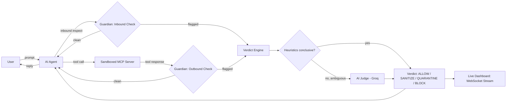

# 🛡️ MCP Guardian

**A Real-Time Security Firewall That Protects AI Agents from Prompt Injection, Tool Poisoning, and Data Leaks**

Team **Mutex** (RH-0045) — RUSH HOUR 24, National Engineering Challenge
Panimalar Engineering College — Cyber Security (Software Track)

| # | Name | Role | Module Ownership |
|---|------|------|-------------------|
| 01 | Sabarish R | Team Lead | Backend core (API, auth, WS proxy) |
| 02 | Vignesh R | Member | Detection engine |
| 03 | Shafeeq S | Member | MCP server + bridge |
| 04 | Rohith V K | Member | Dashboard + live chat UI |

---

## Problem Statement

AI agents are no longer just chatbots. They now connect to files, databases, and
outside tools using a standard called the Model Context Protocol (MCP), and that
opens up two weak spots.

First, a tool the agent trusts can be tampered with to hide secret instructions
inside a normal-looking response, quietly hijacking what the agent does — this is
known as prompt injection or tool poisoning. Second, a user's own prompt can
accidentally send private information or unsafe content straight into the AI.

Most security tools today only check the user's input, or scan the setup once and
produce a report to read later. Nobody is watching the live conversation and
stopping an attack the moment it happens. That is the gap we are setting out to
close.

## Our Solution

MCP Guardian will be a real-time security firewall that sits quietly in the middle
of the conversation between the user, the AI agent, and its tools — a bodyguard
that checks every message going in both directions before it ever reaches the AI.

On the user side, it will scan prompts for private information and for toxic or
unsafe content. On the tool side, it will inspect every tool response for hidden
instructions, disguised payloads, and unexpected data patterns. A fast heuristic
first-pass will catch obvious cases instantly, and anything ambiguous will be
escalated to an AI judge that assigns a risk score (0–100), names the attack
category, and explains its reasoning in plain language.

Every message will resolve to one of four verdicts: **Allow, Sanitize, Quarantine,
or Block**. A live dashboard will stay calm and green while traffic is clean, and
flip to a red alert state the instant something is caught.

## Planned Features

- Real-time bidirectional interception at both the user→agent and tool→agent boundaries
- Fast, deterministic, offline heuristic detection layer (no ML dependency required to run)
- Optional AI-judge escalation tier (Groq) for ambiguous cases: risk score + category + explanation
- Four-tier verdict system: `ALLOW · SANITIZE · QUARANTINE · BLOCK`
- Real (not mocked) sandboxed MCP server as the tool target
- Live SOC-style dashboard with WebSocket event stream
- Auth (JWT) for the dashboard/API
- Stretch goal: Attack Propagation Graph — visualize how far an attack could have
  spread through the agent's tool chain if it had not been blocked

## Planned Tech Stack

**Frontend** — Next.js, React, TypeScript, Tailwind CSS, Recharts
**Backend** — FastAPI, Python 3.12, WebSockets, Server-Sent Events, JWT
**AI/Detection** — heuristic rule engine (regex/entropy/schema checks) + Groq for
LLM-based semantic classification as a second-opinion tier
**Tooling** — official MCP Python SDK (sandboxed stdio server), Docker, GitHub Actions (CI)

## Planned Architecture



## Planned Workflow

1. User sends a message to the AI agent.
2. Guardian intercepts inbound: checks for PII, prompt injection, jailbreak attempts.
3. If clean, the agent proceeds; if flagged, it goes to the verdict engine.
4. When the agent needs a tool, the call goes to a real, sandboxed MCP server.
5. The tool's response is intercepted outbound before the agent sees it: checked
   for hidden instructions, poisoning, encoded payloads, schema anomalies.
6. Heuristics resolve the obvious cases instantly; ambiguous cases escalate to the
   AI judge for a scored, explained verdict.
7. Every event (verdict, score, category, evidence) streams live to the dashboard
   over WebSocket.
8. The agent's final reply reaches the user only after passing inspection.

## Planned Folder Structure

```
mcp-guardian/
├── backend/          # FastAPI app: auth, API routes, detection engine, WS
├── dashboard/         # Next.js frontend: chat UI + SOC dashboard
├── mcp-servers/
│   └── filesystem/    # sandboxed MCP server (isolated venv)
├── sandbox/           # files the MCP server is allowed to read (test docs)
├── scripts/           # setup/start/smoke-test scripts
├── .github/workflows/ # CI
├── docker-compose.yml
└── README.md
```

## Installation & Usage (planned)

```bash
# clone
git clone https://github.com/Shafeeq-Cybersec/MCP-Guardian.git
cd MCP-Guardian

# setup (once scaffolding lands)
./scripts/setup.sh      # or setup.ps1 on Windows
./scripts/start.sh       # or start.ps1
```

Full setup instructions will be added as the backend and dashboard are scaffolded.

## API / Database Documentation

_To be added once the API is implemented._

## AI/ML Workflow

_To be added once the detection engine and AI-judge escalation are implemented._

## Security Measures

Planned: JWT-based auth, sandboxed MCP server restricted to a local directory,
input/output inspection at both trust boundaries, fail-safe defaults (block on
detector failure rather than silently allow).

## Testing & Performance

_To be added once test suites are written and run against the built system._

## Challenges Faced & Future Scope

_To be filled in as development progresses._

## Demo Screenshots / Video

_To be added closer to submission, once the UI and end-to-end flow are working._

## References

- Model Context Protocol (MCP) specification
- Groq API documentation

## Status

🚧 Kickoff — problem defined, architecture planned, build starting.

---
Built for RUSH HOUR 24 — Sathyabama Institute of Science and Technology.
